# powerlytics-embedded

# STM32 BlackPill Generic IoT Gateway Firmware — Current Flow, Architecture & Improvement Report

**Source zip analyzed:** `BALCKPILL_BASED_GENERIC_GATEWAY.zip`  
**Project detected:** STM32CubeIDE / STM32F407VETx / FreeRTOS CMSIS-RTOS2  
**Primary firmware folder:** `BALCKPILL_BASED_GENERIC_GATEWAY/`  
**Main MCU target:** `STM32F407VETx`, 512 KB Flash, 128 KB SRAM, 64 KB CCM RAM  

---

## 1. Executive summary

The codebase is a working-stage embedded firmware for an industrial IoT gateway built around STM32F407, cellular modem MQTT, analog/digital I/O, Modbus RTU, RTC, and flash-based configuration. The current architecture has many useful building blocks already present: UART DMA-to-IDLE receive engine, MQTT AT-command stack, config JSON parsing, SHA-256 validation, internal flash config save/load, W25Q flash driver, ADC/DI payload generation, Modbus RTU master, and FreeRTOS tasks.

However, the current runtime wiring is incomplete. The firmware currently boots, initializes hardware, reads config from flash, connects modem/network/MQTT, subscribes to the command topic, builds a telemetry JSON, and publishes it periodically. But several major modules are not actually connected into the running system:

- The Modbus configuration is loaded only for printing; it is not applied to the payload builder.
- The Modbus master context is never initialized.
- The Modbus task is empty.
- MQTT downlink handling is subscribed but currently commented out in the main loop.
- The offline publish queue module exists but is not used.
- The config staging module exists but is not used by the current downlink handler.

The highest-risk flaws are pin conflicts, incomplete initialization, blocking reset-based network recovery, hardcoded credentials/device IDs, logging inside UART RX callbacks, no watchdog/error telemetry, and fragile modem/MQTT command handling.

---

## 2. Repository / firmware structure

```text
BALCKPILL_BASED_GENERIC_GATEWAY/
├── BALCKPILL_BASED_GENERIC_GATEWAY.ioc       # STM32CubeMX config
├── STM32F407VETX_FLASH.ld                    # Flash linker script
├── STM32F407VETX_RAM.ld                      # RAM linker script
├── Core/
│   ├── Inc/
│   │   ├── main.h
│   │   ├── config.h                          # APN/MQTT hardcoded config
│   │   ├── modem_handler.h                   # AT/GPRS public API
│   │   ├── mqtt_handler.h                    # MQTT publish/subscribe/config API
│   │   ├── uart2_rx_engine.h                 # UART DMA ring buffer engine; currently used for UART6
│   │   ├── app_board_io.h                    # ADC/DI/relay abstraction
│   │   ├── app_modbus_payload.h              # Telemetry payload builder
│   │   ├── modbus_config.h                   # Struct stored in flash
│   │   ├── modbus_config_json.h              # Config JSON parser
│   │   ├── modbus_rtu_master.h               # DMA-to-IDLE Modbus master
│   │   ├── modbus_rtu.h                      # Older blocking Modbus master
│   │   ├── pub_queue.h                       # In-RAM publish queue, currently unused
│   │   ├── rtc_manager.h
│   │   ├── w25q16.h
│   │   ├── sha256.h
│   │   └── cJSON.h
│   └── Src/
│       ├── main.c                            # Boot + RTOS tasks + UART callbacks
│       ├── modem_handler.c                   # AT command, GPRS, network diagnostics, HTTP check
│       ├── mqtt_handler.c                    # MQTT connect/subscribe/publish/downlink config
│       ├── uart2_rx_engine.c                 # UART ring buffer read-line/wait-for helpers
│       ├── app_board_io.c                    # ADC, DI, relay GPIO handling
│       ├── app_modbus_payload.c              # JSON telemetry builder + Modbus read calls
│       ├── modbus_config_flash.c             # STM32 internal flash config persistence
│       ├── modbus_config_json.c              # JSON -> modbus_cfg_t parser
│       ├── modbus_rtu_master.c               # DMA Modbus master
│       ├── modbus_rtu.c                      # Older polling Modbus driver
│       ├── config_apply.c                    # Pending config staging, currently unused
│       ├── pub_queue.c                       # RAM queue, currently unused
│       ├── w25q16.c                          # External SPI flash driver
│       ├── rtc_manager.c
│       ├── debug_uart.c
│       └── stm32f4xx_hal_msp.c               # Cube peripheral pin/DMA init
├── Drivers/                                  # STM32 HAL/CMSIS
└── Middlewares/Third_Party/FreeRTOS/         # FreeRTOS CMSIS v2
```

Approximate user application source size under `Core/` is about 10.9k lines including cJSON and generated code.

The existing debug ELF sections show roughly:

| Section | Size | Notes |
|---|---:|---|
| `.text` | ~54.9 KB | executable code |
| `.rodata` | ~5.8 KB | strings/constants |
| `.data` | ~96 B | initialized RAM |
| `.bss` | ~38.3 KB | static buffers, RTOS objects, globals |

This is still small relative to STM32F407VETx flash/RAM, but RAM pressure can increase quickly when config buffers, queues, dynamic JSON allocations, task stacks, and future OTA logic are added.

---

## 3. Current hardware/peripheral architecture

### 3.1 MCU and RTOS

- MCU: `STM32F407VETx`.
- RTOS: FreeRTOS via CMSIS-RTOS2.
- System clock: currently HSI without PLL in `SystemClock_Config()`, so the CPU is likely running at 16 MHz.
- FreeRTOS heap: `configTOTAL_HEAP_SIZE = 15360` bytes.
- FreeRTOS tick: 1 kHz.
- Stack overflow hooks and malloc failure hooks are not currently enabled.

### 3.2 Current CubeMX/peripheral mapping seen in code

| Function | Current code/peripheral | Pins from Cube / code | Notes |
|---|---|---|---|
| Debug UART | USART1 | PB6 TX, PB7 RX | Used by `debug_uart.c` blocking `HAL_UART_Transmit()` |
| Modem UART | USART6 | PC6 TX, PC7 RX | Current `MODEM_UART_HANDLE` points to `huart6` |
| Legacy modem pin labels | USART2 | PD5 TX, PD6 RX in `main.h`/ioc labels | USART2 is not initialized in current `main.c` |
| Modbus UART | USART3 | PD8 TX, PD9 RX | DMA RX configured on DMA1 Stream1 Channel4 |
| SPI flash bus | SPI1 | PB3 SCK, PB4 MISO, PB5 MOSI | W25Q CS hardcoded as PB0 in `flash_test()` |
| RTC | RTC | LSE/LSI fallback | RTC init currently has duplicated/default date logic |
| ADC | ADC1 | Mixed manual init for PC0-PC4, PA0-PA5, PB0 | Only PA0/PA1 are in Cube ADC MSP; rest manually initialized |
| Digital inputs | GPIO | PD1, PD3, PD5, PD7, PA7, PC5, PB1 currently listed | Array has 7 entries but reader loops 8 entries |
| Relays | GPIO | PD6, PD4, PD0, PC7, PC6 currently listed | Conflicts with USART6 PC6/PC7 and USART2 PD6 label |

---

## 4. Current runtime flow

### 4.1 Boot sequence

The current boot flow is mostly in `Core/Src/main.c`.

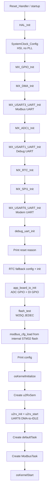

Important observation: `modbus_cfg_load()` is called and printed, but the loaded `cfg_from_flash` is not passed into `app_modbus_payload_set_cfg()`. The Modbus master object `g_mbm` is also not initialized with `mbm_init()`. So loaded Modbus config currently does not drive Modbus reads.

---

### 4.2 Default task current flow

`StartDefaultTask()` is the only meaningful application task today.

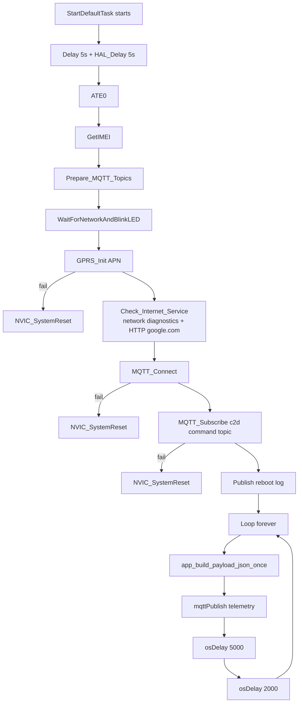

Current telemetry loop period is effectively ~7 seconds plus time spent reading ADC/Modbus and publishing over AT commands.

Downlink handling exists but is commented out:

```c
// char *rx = MQTT_Subscriber_Run();
// if (rx) {
//     print("[DOWNLINK] %s\r\n", rx);
//     handle_downlink_cjson(rx);
// }
```

So the device subscribes to the command topic, but it does not actively consume and apply received commands in the current main loop.

---

### 4.3 UART receive callback flow

The firmware uses `HAL_UARTEx_RxEventCallback()` to handle DMA-to-IDLE events.

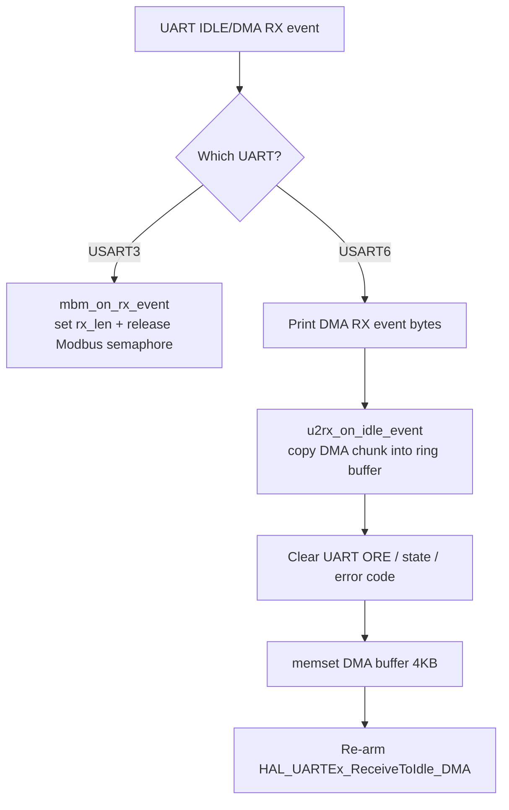

This design is functional for bring-up debugging, but not production-safe because the callback prints large data from interrupt context and clears a 4 KB DMA buffer inside the callback.

---

### 4.4 Modem/AT flow

The modem code uses a shared UART ring buffer and line-based AT parser.

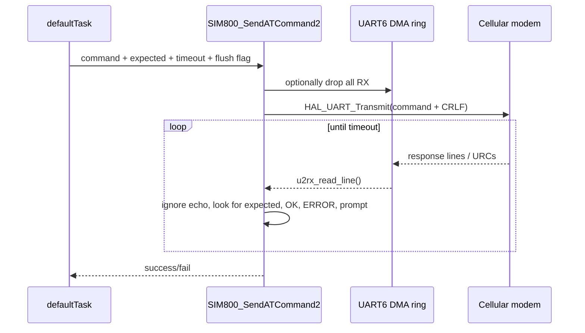

The AT command engine currently treats command text, topic text, and payload text similarly. For modem prompt-driven binary/text payload modes, a production design should send exact bytes after prompt and then wait for the modem terminator/URC using a separate function, not a generic line command wrapper.

---

### 4.5 MQTT current flow

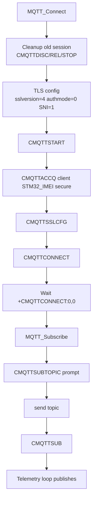

Current publish sequence:

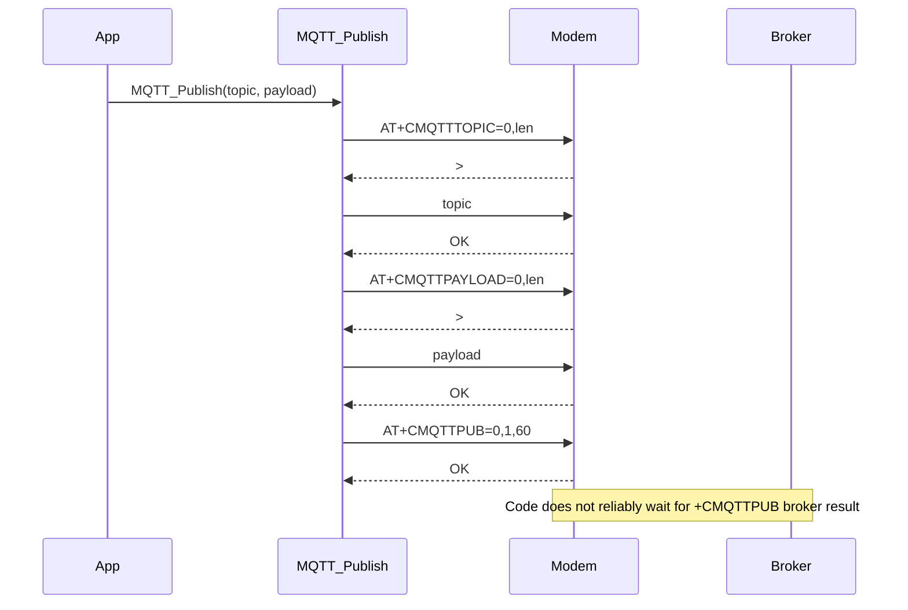

Important: `lastMQTTSuccessTime` is updated after the modem accepts the publish command, not necessarily after broker-level publish success.

---

### 4.6 Current config downlink flow

The code has a downlink config handler but main loop currently does not call `MQTT_Subscriber_Run()`.

If manually called, the current config flow is:

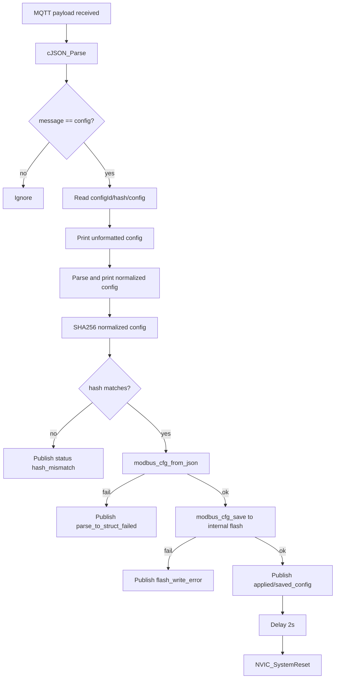

This has good validation intent, but it lacks a robust two-phase config apply model. The status publish can be lost if network is unstable and the device resets immediately after publishing.

---

### 4.7 Current payload builder flow

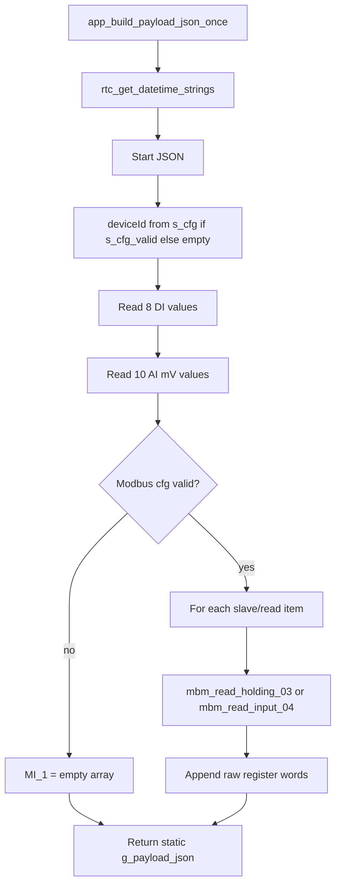

Because `app_modbus_payload_set_cfg()` is never called, `s_cfg_valid` remains false, so `deviceId` is empty and `MI_1` is normally empty.

---

## 5. Current module responsibilities

| Module | Current responsibility | Current runtime status |
|---|---|---|
| `main.c` | Peripheral init, RTOS task creation, UART RX callback, default telemetry loop | Active |
| `debug_uart.c` | Blocking formatted UART debug print | Active, but not thread/ISR safe |
| `uart2_rx_engine.c` | DMA RX chunk -> ring buffer; read-line/wait-for helpers | Active for USART6 despite name `uart2` |
| `modem_handler.c` | AT command engine, IMEI, GPRS, network diagnostics, HTTP check | Active |
| `mqtt_handler.c` | MQTT connect/subscribe/publish, downlink config parsing | Connect/publish active; downlink parser currently not called |
| `app_board_io.c` | DI/ADC/relay GPIO handling | ADC/DI active; relay init disabled |
| `app_modbus_payload.c` | Builds telemetry JSON and optionally performs Modbus reads | Active, but Modbus config not injected; Modbus context not initialized |
| `modbus_rtu_master.c` | DMA-to-IDLE Modbus master | Present but not initialized/called in current runtime |
| `modbus_rtu.c` | Older blocking Modbus master | Present, apparently unused; also conflicts conceptually with DMA driver |
| `modbus_config_json.c` | Config JSON to struct parser | Used by downlink handler only; downlink not called currently |
| `modbus_config_flash.c` | Internal STM32 flash config persistence | Load called at boot; save called only by downlink handler |
| `w25q16.c` | External flash driver | Only JEDEC test; not used for config/offline queue |
| `pub_queue.c` | RAM publish queue | Present but unused |
| `config_apply.c` | Pending config staging | Present but unused |
| `rtc_manager.c` | RTC clock source fallback and timestamp formatting | Active |

---

## 6. Critical issues found

### 6.1 Modbus pipeline is not actually wired

Evidence:

- `main.c` loads `cfg_from_flash` and prints it.
- No call to `app_modbus_payload_set_cfg(&cfg_from_flash)`.
- No call to `rs485_init()`.
- No call to `mbm_init()`.
- No call to `app_modbus_payload_init(&g_mbm)`.
- `StartTask02()` only delays forever.

Current impact:

- Telemetry payload will not include real Modbus values.
- Device ID inside telemetry can be empty because payload builder depends on `s_cfg_valid` inside `app_modbus_payload.c`.
- `MI_1` remains an empty array unless someone manually calls the missing init/setter functions.

Immediate fix direction:

```c
// After loading cfg_from_flash and after osKernelInitialize if semaphore is needed:
mbRxSemHandle = osSemaphoreNew(1, 0, NULL);
rs485_init(&g_rs485, RS485_DE_GPIO_Port, RS485_DE_Pin);
mbm_init(&g_mbm, &huart3, &g_rs485, mb_rx_buf, sizeof(mb_rx_buf), mbRxSemHandle);
app_modbus_payload_init(&g_mbm);
app_modbus_payload_set_cfg(&cfg_from_flash);
```

But before adding this, fix the RS485 DE pin definition. The main comment says DE is PD11, but the current `.ioc` and `main.h` do not define PD11.

---

### 6.2 MQTT downlink/config flow is subscribed but not processed

`MQTT_Subscribe(topic_c2d_commands)` is called, but the receive loop is commented out inside `StartDefaultTask()`.

Current impact:

- Cloud config commands will not be consumed.
- Actuation commands will not be consumed.
- Subscribed modem URCs may accumulate in the UART ring while telemetry publish code continues using the same ring.

Immediate fix direction:

At minimum, re-enable subscriber polling:

```c
char *rx = MQTT_Subscriber_Run();
if (rx) {
    handle_downlink_cjson(rx);
}
```

Production fix direction: create a dedicated `MqttRxTask`/URC parser that continuously consumes modem URCs and routes them to config/command queues.

---

### 6.3 Pin conflicts and GPIO map inconsistencies

This is the most urgent hardware/software cleanup area.

| Conflict / issue | Where seen | Why it matters |
|---|---|---|
| PB0 is W25Q CS and also configured as ADC analog | `flash_test()` uses PB0 CS; `app_board_io.c` configures PB0 analog | External flash CS can stop working after `app_board_io_init()` reconfigures PB0 as analog |
| PC6/PC7 are USART6 TX/RX and also relay pins | `stm32f4xx_hal_msp.c` USART6; `app_board_io.c` relays | If relay init is enabled, it will break modem UART. If USART6 is used, these relays cannot work. |
| PD6 is old USART2_RX label and relay pin | `main.h` / `app_board_io.c` | Board revision confusion; relay/modem pin map is not clean. |
| PD5 is old USART2_TX label and DI pin | `main.h` / `app_board_io.c` | If USART2 modem is restored, DI conflicts with modem TX. |
| PD3 initialized as GPIO output in `MX_GPIO_Init()` and also listed as DI | `main.c` and `app_board_io.c` | Same pin cannot be both output and input. |
| DI array has 7 entries but `app_di_read_all()` loops 8 | `app_board_io.c` | Out-of-bounds access; can read random memory/pin and cause undefined behavior. |
| DI init does not initialize all DI pins in array | `app_board_io.c` | Example: PD5 appears in array but DI GPIO init initializes only PD1/PD3/PD7 on port D. |
| Relay init does not initialize PD6 | `app_board_io.c` | `g_relays[0]` uses PD6 but `Relay_GPIO_Init_User()` initializes only PD4/PD0 and PC7/PC6. |

Recommended correction:

- Create a single `board_pins.h` as the source of truth.
- Remove all duplicated pin ownership from `main.h`, `.ioc` labels, and application arrays.
- Define board revisions explicitly, e.g. `BOARD_REV_A`, `BOARD_REV_B`.
- Generate a compile-time conflict check pattern.

Example:

```c
typedef enum {
    PIN_ROLE_UNUSED,
    PIN_ROLE_MODEM_TX,
    PIN_ROLE_MODEM_RX,
    PIN_ROLE_RS485_TX,
    PIN_ROLE_RS485_RX,
    PIN_ROLE_RS485_DE,
    PIN_ROLE_FLASH_CS,
    PIN_ROLE_AI,
    PIN_ROLE_DI,
    PIN_ROLE_RELAY,
    PIN_ROLE_DEBUG_TX,
    PIN_ROLE_DEBUG_RX,
} pin_role_t;
```

For immediate stabilization, choose one modem UART path:

- Option A: **USART6 PC6/PC7 for modem**. Then remove PC6/PC7 from relay list.
- Option B: **USART2 PD5/PD6 for modem**. Then remove PD5 from DI and PD6 from relay list, re-enable USART2 init/DMA/IRQ cleanly.

Do not keep mixed comments/code saying UART2 while runtime uses UART6.

---

### 6.4 External W25Q flash is tested but not used productively

The project has a W25Q16 driver, but config is stored in STM32 internal flash at `0x08060000`, not W25Q.

Current impact:

- W25Q is not helping with offline telemetry queue, logs, config slots, crash history, or OTA staging.
- Internal flash sector usage is not reserved in the linker script. Today it may be safe because firmware is small, but future code growth can overlap that config address unless explicitly reserved.
- PB0 conflict makes W25Q unreliable if PB0 remains ADC.

Recommended storage strategy:

Use W25Q for high-write data:

- offline telemetry queue/spool,
- persistent logs,
- config A/B slots,
- crash snapshots,
- OTA staging if needed.

Use internal flash only for rare bootstrap data:

- factory identity,
- hardware revision,
- secure bootstrap endpoint,
- active config pointer if absolutely needed.

---

### 6.5 Network recovery currently resets the MCU too aggressively

Current reset behavior:

- GPRS init fail -> `NVIC_SystemReset()`.
- MQTT connect fail -> `NVIC_SystemReset()`.
- MQTT subscribe fail -> `NVIC_SystemReset()`.
- Config apply success -> publish status, delay, reset.

Current impact:

- Poor reliability in weak-signal environments.
- Possible reset loops when APN/SIM/network/broker has temporary problems.
- Telemetry is lost because there is no persistent queue.
- Logs explaining the failure may be lost on reset.

Recommended behavior:

Use a connection finite-state machine instead of immediate MCU reset.

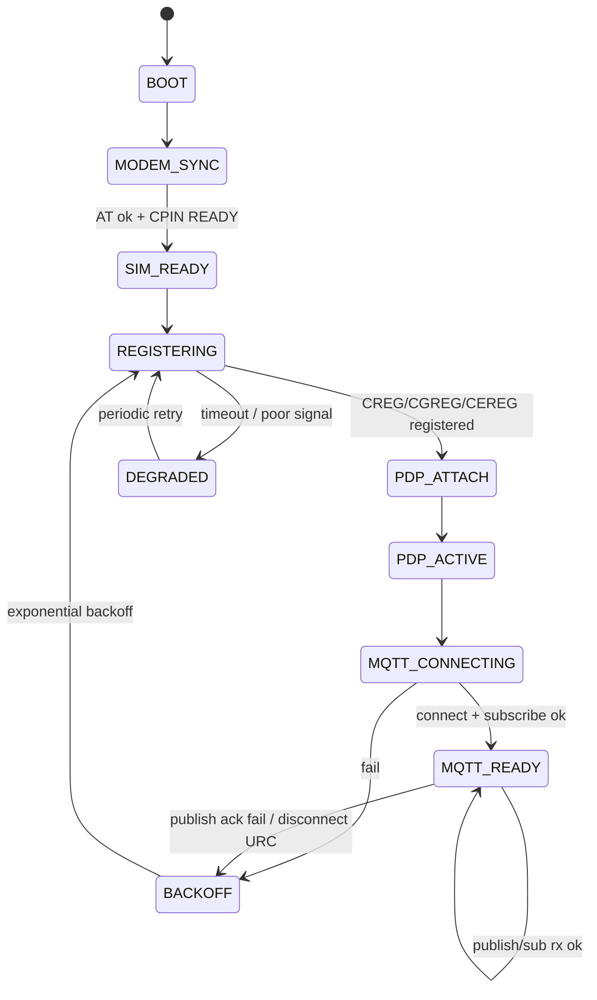

Reset only for fatal unrecoverable conditions:

- modem UART stuck after repeated hardware power-cycle attempts,
- heap corruption/assert/fault,
- watchdog timeout,
- repeated boot failure with controlled safe mode.

---

### 6.6 Modem/MQTT command handling is fragile under URC-heavy conditions

The modem produces asynchronous URCs. The current AT engine reads lines until it sees expected/OK/ERROR. That is okay for simple commands but fragile for MQTT because MQTT connect, subscribe, publish, and receive all rely on asynchronous URCs.

Specific concerns:

- `MQTT_Connect()` correctly split immediate `OK` and `+CMQTTCONNECT: 0,0`, but if the URC arrives before the function starts waiting for it, it can be consumed/ignored by the command engine.
- `MQTT_Subscribe()` expects `+CMQTTSUB: 0,0` through `SendCommandWithRetry()`. Some modems emit immediate `OK` first and the URC later. This can fail depending on timing.
- `MQTT_Publish()` checks only command acceptance `OK`, not final `+CMQTTPUB` status.
- Payload and topic are sent through the same generic AT command wrapper rather than exact prompt-write helper.
- `lastMQTTSuccessTime` is updated before broker-level publish confirmation.

Recommended model:

- One `ModemRxTask` owns all UART RX parsing.
- AT command function waits on command response events.
- URCs are never discarded; they are routed to queues.
- MQTT publish waits for publish completion URC before marking success.
- MQTT subscriber receive parser handles topic + payload exact lengths as a proper state machine.

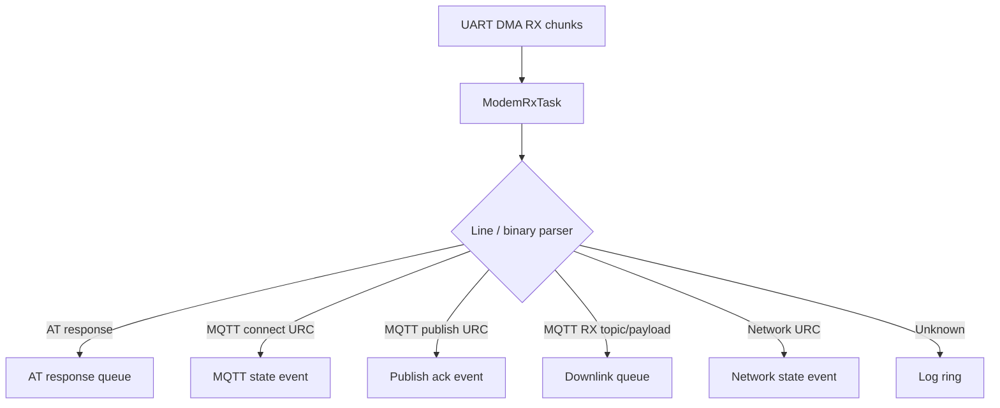

---

### 6.7 Logging is not production-grade yet

Current logging is mostly direct `print()` over debug UART:

```c
void print(const char *fmt, ...) {
    char buf[1024];
    vsnprintf(buf, sizeof(buf), fmt, args);
    HAL_UART_Transmit(dbg_huart, (uint8_t*)buf, strlen(buf), 1000);
}
```

Problems:

- Blocking UART transmit can stall tasks.
- 1 KB stack buffer inside `print()` is expensive for small task stacks.
- `print()` is called inside `HAL_UARTEx_RxEventCallback()`, which is interrupt context.
- No log levels, module IDs, event IDs, rate limiting, or persistent storage.
- No fault register dump in HardFault/BusFault/etc.
- No cloud log queue except a single reboot log publish.

Recommended logging architecture:

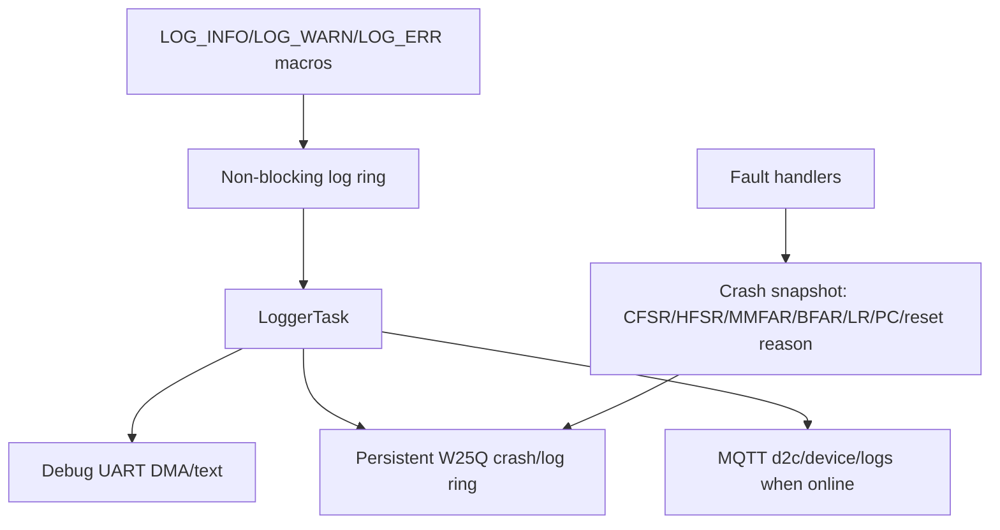

Proposed log event shape:

```c
typedef enum {
    LOG_DEBUG,
    LOG_INFO,
    LOG_WARN,
    LOG_ERROR,
    LOG_FATAL
} log_level_t;

typedef struct {
    uint32_t seq;
    uint32_t tick_ms;
    uint32_t rtc_unix;
    log_level_t level;
    uint16_t module;
    uint16_t event;
    int32_t  value1;
    int32_t  value2;
} log_event_t;
```

Cloud JSON example:

```json
{
  "deviceId": "...",
  "ts": "2026-06-21T...Z",
  "seq": 10233,
  "level": "WARN",
  "module": "MODEM",
  "event": "MQTT_PUBLISH_ACK_TIMEOUT",
  "rssi": 11,
  "backoffMs": 30000
}
```

---

### 6.8 Error handling is mostly boolean/print/reset

Current pattern:

- Many functions return `uint8_t` success/fail.
- Modbus returns `HAL_StatusTypeDef` without detailed reason in payload.
- Flash save returns bool.
- Fault handlers loop forever without recording why.
- `Error_Handler()` disables IRQ and loops.

Recommended pattern:

Introduce a project-wide error code model:

```c
typedef enum {
    GW_OK = 0,
    GW_ERR_TIMEOUT,
    GW_ERR_BUSY,
    GW_ERR_BAD_STATE,
    GW_ERR_INVALID_ARG,
    GW_ERR_UART_OVERRUN,
    GW_ERR_MODEM_NO_AT,
    GW_ERR_SIM_NOT_READY,
    GW_ERR_NETWORK_NOT_REGISTERED,
    GW_ERR_PDP_ATTACH_FAIL,
    GW_ERR_MQTT_CONNECT_FAIL,
    GW_ERR_MQTT_PUBLISH_ACK_FAIL,
    GW_ERR_MODBUS_TIMEOUT,
    GW_ERR_MODBUS_CRC,
    GW_ERR_MODBUS_EXCEPTION,
    GW_ERR_FLASH_WRITE,
    GW_ERR_CONFIG_SCHEMA,
    GW_ERR_CONFIG_HASH,
} gw_status_t;
```

Then all major modules can expose structured status and health counters.

---

## 7. Current hardcoded values to remove or centralize

| Hardcoded item | Current location | Recommendation |
|---|---|---|
| APN = `www` | `config.h` | Store in provisioned config or carrier profile |
| MQTT broker URI | `config.h` | Use bootstrap config + server-provided config |
| MQTT username/password | `config.h` | Unique per-device credentials; never commit real secrets |
| Device ID in MQTT topics | `mqtt_handler.c` | Use loaded config/factory identity/IMEI provisioning |
| Google HTTP check URL | `modem_handler.c` | Replace with lightweight backend `/healthz` or remove HTTP check |
| Internal flash config address `0x08060000` | `modbus_config_flash.c` | Reserve in linker or move to W25Q config slots |
| ADC scaling `*3.94` | `app_board_io.c` | Use per-channel calibration config as fixed-point ratio |
| ADC VREF 3320 mV | `app_board_io.c` | Calibrate/store factory ADC Vref or read Vrefint |
| Poll delays 5s/2s | `main.c` | Use config-driven telemetry interval and RTOS timers |
| Modbus max slaves/read counts | `modbus_config.h` | Keep compile-time max, but validate and expose limits to backend |

---

## 8. Recommended production architecture

### 8.1 Proposed task-level architecture

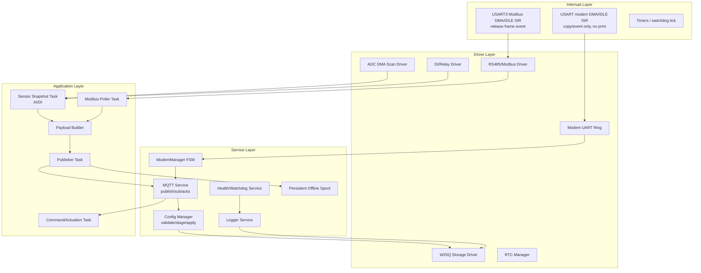

### 8.2 Proposed runtime data flow

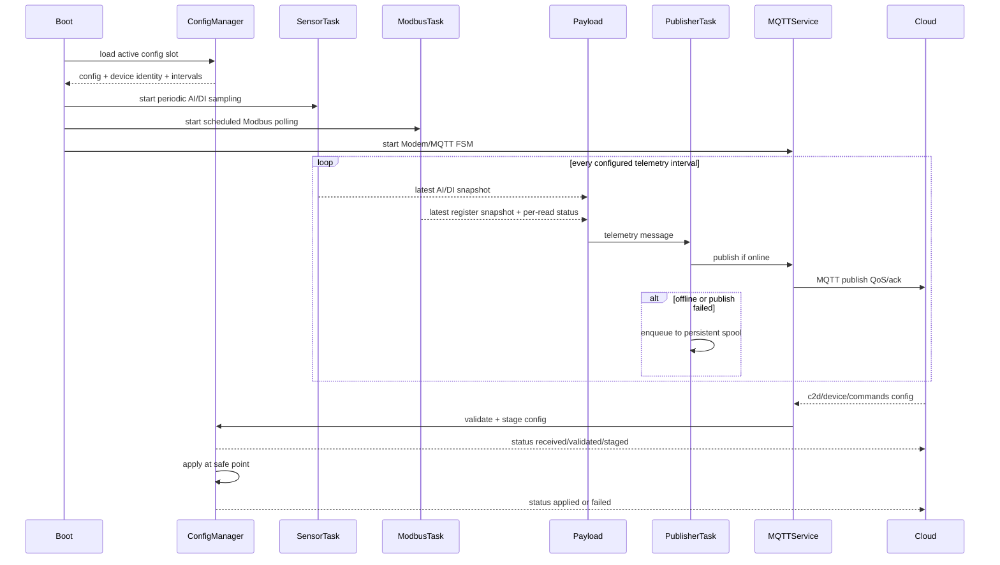

---

## 9. Improved network connectivity design

### 9.1 Avoid reset-loop behavior

Use progressive recovery:

1. Check modem AT responsiveness.
2. Check SIM ready.
3. Check signal quality.
4. Check registration: support home and roaming.
5. Attach PDP.
6. Activate PDP context.
7. Start MQTT.
8. Connect.
9. Subscribe.
10. Publish heartbeat.

If any stage fails, record reason, wait with exponential backoff, and retry from the appropriate earlier stage.

Example backoff:

| Failure | First retry | Max retry | Escalation |
|---|---:|---:|---|
| MQTT publish ack fail | 2 s | 60 s | reconnect MQTT only |
| MQTT connect fail | 5 s | 5 min | restart MQTT service, then PDP |
| PDP attach fail | 10 s | 10 min | re-check registration/SIM |
| AT no response | 1 s | 60 s | modem power-cycle pin, then MCU reset only after N attempts |
| SIM not ready | 30 s | 10 min | degraded mode, no reset |

### 9.2 Network health telemetry

Publish periodic health status separately from data telemetry:

```json
{
  "deviceId": "...",
  "ts": "...",
  "type": "health",
  "uptimeMs": 12345678,
  "resetReason": "IWDG",
  "modem": {
    "imei": "...",
    "rssi": 17,
    "registered": true,
    "roaming": false,
    "pdpActive": true,
    "mqttConnected": true,
    "lastPublishAckMs": 120
  },
  "errors": {
    "modbusTimeouts": 4,
    "mqttReconnects": 2,
    "uartOverruns": 0,
    "offlineQueued": 12
  }
}
```

### 9.3 Offline queue / store-and-forward

Current `pub_queue.c` is RAM-only and unused. For production, use W25Q as persistent spool:

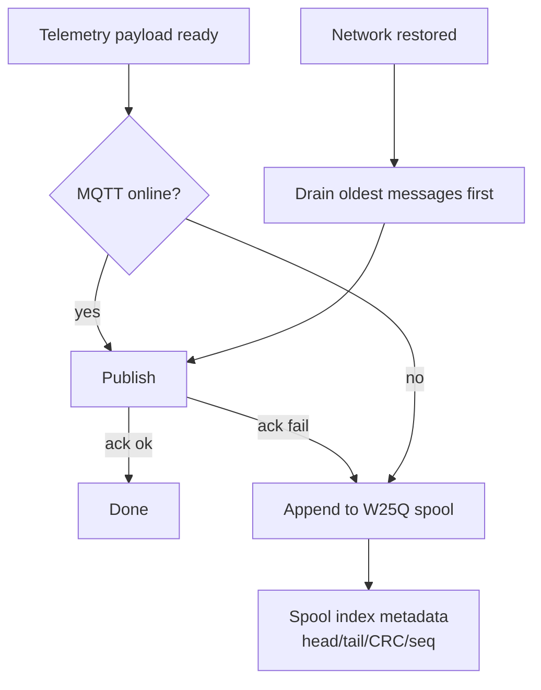

Design details:

- Assign every message a monotonically increasing sequence number.
- Store `{seq, topic, payload_len, crc32, timestamp, retry_count}`.
- Drain oldest first to preserve time order.
- Apply max retention policy.
- Separate telemetry, logs, status, and command ACK queues by priority.

---

## 10. Improved Modbus architecture

### 10.1 Current limitations

- Modbus config is parsed into a struct, but not injected into runtime.
- Modbus task does nothing.
- Reads are executed from `app_build_payload_json_once()` if `s_cfg_valid` is set, which blocks publishing and makes response time dependent on Modbus timeouts.
- Per-slave serial settings are parsed but not applied to `USART3` before reading each slave.
- `retries` field is parsed but not used in `app_modbus_payload.c`.
- Adjacent register reads are not grouped.
- No per-register error status appears in payload.

### 10.2 Recommended Modbus polling design

Use `ModbusTask` as a scheduler:

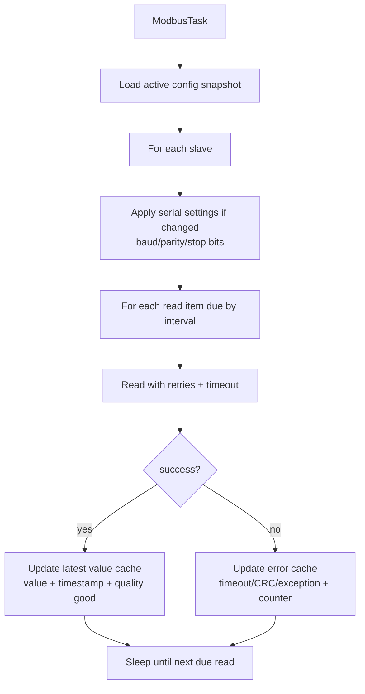

Payload builder should read from the latest Modbus value cache, not perform slow Modbus transactions during MQTT publish.

### 10.3 Better Modbus payload shape

Current payload only sends arrays of raw words. Add status and timestamp per read:

```json
{
  "readId": "uuid",
  "value": [123, 456],
  "quality": "good",
  "err": 0,
  "ageMs": 830
}
```

On failure:

```json
{
  "readId": "uuid",
  "value": null,
  "quality": "bad",
  "err": "MODBUS_TIMEOUT",
  "ageMs": null
}
```

This lets the backend distinguish “real zero” from “read failed”.

---

## 11. Improved configuration architecture

### 11.1 Current configuration handling

Current downlink expects:

```json
{
  "message": "config",
  "configId": "...",
  "hash": "sha256-of-normalized-config",
  "config": {
    "device_id": "...",
    "configId": "...",
    "imei": "...",
    "modbusSlaves": []
  }
}
```

The code validates hash, parses Modbus config, saves to internal flash, publishes status, then resets.

### 11.2 Recommended safer config state machine

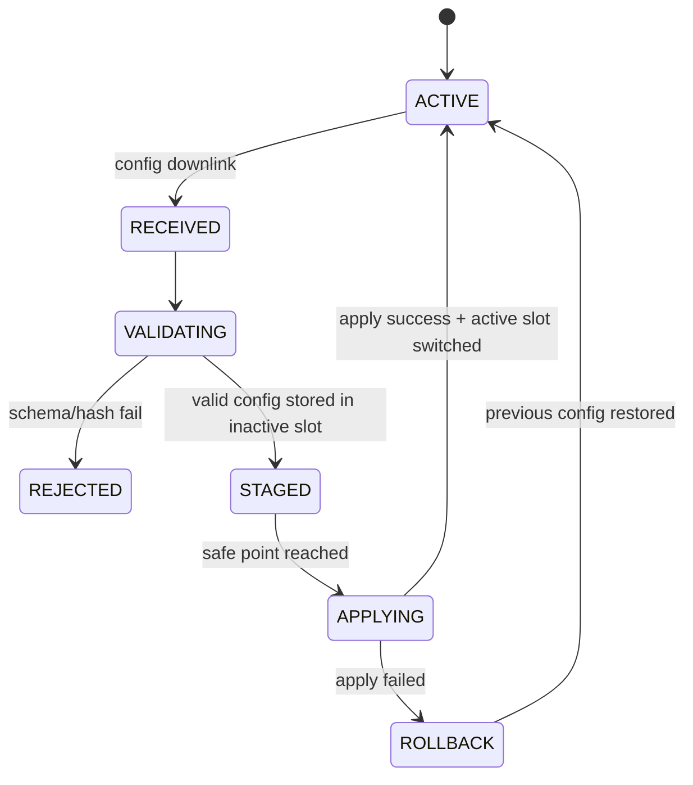

Status messages should be sent at each step:

```json
{"status":"received","configId":"..."}
{"status":"validated","configId":"..."}
{"status":"staged","configId":"..."}
{"status":"applied","configId":"..."}
```

On failure:

```json
{"status":"error","configId":"...","message":"schema_invalid","field":"modbusSlaves[0].slave_id"}
```

### 11.3 Recommended config storage layout

Use A/B config slots:

```text
W25Q or reserved internal flash
├── config_manifest
│   ├── magic
│   ├── version
│   ├── active_slot
│   ├── slot_a_crc
│   ├── slot_b_crc
│   └── rollback_counter
├── slot_a
│   └── config blob + crc + schema version
└── slot_b
    └── config blob + crc + schema version
```

Benefits:

- Power-loss safe updates.
- Easy rollback if new config breaks Modbus/UART.
- Can acknowledge “staged” before reset.
- Can retry status publish after reboot.

---

## 12. Performance improvements

### 12.1 Remove heavy work from ISR

Current UART RX callback does:

- printing,
- byte-by-byte debug dump,
- `u2rx_on_idle_event()`,
- clearing UART state manually,
- `memset()` of a 4 KB DMA buffer,
- rearming DMA.

Recommended:

- ISR should only capture DMA event and release a task/semaphore.
- No UART debug print in ISR.
- No 4 KB `memset()` in ISR.
- Do not manually force `huart->RxState = HAL_UART_STATE_READY` unless there is a documented HAL recovery path.
- Move buffer dump to debug mode in a task.

### 12.2 ADC performance

Current ADC reading:

- Reconfigures ADC channel for every channel.
- Performs dummy conversion for each channel.
- Performs 16 conversions per channel.
- Uses multiplication by `3.94`, which brings floating/double math into firmware.

Recommended:

- Use ADC scan mode + DMA for the 10 channels.
- Use oversampling in a periodic ADC task.
- Use fixed-point scaling:

```c
// Instead of mv * 3.94, use mv * 394 / 100
out_mv = (raw_mv * scale_num[channel]) / scale_den[channel];
```

- Store per-channel calibration in config/factory data:

```c
typedef struct {
    uint16_t scale_num;
    uint16_t scale_den;
    int16_t offset_mv;
} ai_cal_t;
```

### 12.3 Payload building

Current payload is built with manual `snprintf()` into a 2 KB static buffer. This is better than dynamic JSON allocation for telemetry, but the max size is risky as Modbus config grows.

Recommended:

- Return explicit build status: OK/TRUNCATED/INVALID.
- Check every `jb_append()` result.
- Include buffer size planning based on max channels/slaves/registers.
- Consider compact CBOR/protobuf only if bandwidth becomes a real issue; JSON is fine for early product debugging.

### 12.4 MQTT publish responsiveness

Current main loop blocks while building payload and publishing through multiple AT commands. During this time, downlinks may not be processed.

Recommended:

- Separate publish queue from MQTT RX parser.
- Downlink RX should always be processed with higher priority than telemetry publish.
- Use command/response timeouts that do not block unrelated tasks.

---

## 13. Security improvements

Current risk areas:

- MQTT password is hardcoded in `config.h`.
- TLS config uses `authmode=0`, meaning server certificate is not verified.
- MQTT username appears shared/static.
- Device ID is hardcoded in topic generation.
- Hash validation protects config integrity only if the hash source is trusted; it is not authentication by itself.

Recommended production model:

1. Factory provision each device with:
   - device serial,
   - hardware revision,
   - unique device ID,
   - per-device MQTT username/password or certificate,
   - backend bootstrap endpoint.
2. Use TLS server certificate verification if modem supports it.
3. Use per-device scoped credentials, not one shared broker password.
4. Use cloud-side ACLs:
   - device can publish only `d2c/<deviceId>/#`,
   - device can subscribe only `c2d/<deviceId>/commands`.
5. Add config message signature/HMAC, not just plain SHA-256 of config.

Recommended config command envelope:

```json
{
  "type": "config.update",
  "deviceId": "...",
  "configId": "...",
  "issuedAt": "...",
  "nonce": "...",
  "config": {...},
  "signature": "HMAC-SHA256 or ECDSA"
}
```

---

## 14. Immediate stabilization plan

### Phase 1 — make current code functionally correct

1. Finalize one pin map.
2. Fix all pin conflicts.
3. Fix DI array length and GPIO init.
4. Decide W25Q CS vs PB0 ADC conflict.
5. Initialize Modbus master and pass loaded config to payload builder.
6. Re-enable downlink receive polling or add basic `MqttRxTask`.
7. Remove `print()` from UART RX callback.
8. Remove `HAL_Delay()` after scheduler start; use `osDelay()` only in tasks.
9. Stop resetting MCU on normal network errors.
10. Add basic watchdog and persistent reset/error counters.

### Phase 2 — make it reliable in the field

1. Add ModemManager FSM.
2. Add MQTT service with URC parser and publish ACK tracking.
3. Add persistent W25Q offline queue.
4. Add structured logging with local ring + cloud logs.
5. Add Modbus scheduler/cache with per-read quality.
6. Add config A/B slots and rollback.
7. Add health telemetry.
8. Add fault snapshot capture.

### Phase 3 — make it production-grade

1. Unique device provisioning and secure credentials.
2. TLS certificate verification.
3. OTA update architecture.
4. Hardware abstraction for board variants.
5. CI static analysis, unit tests for parsers, hardware-in-loop smoke tests.
6. Backend-device protocol versioning.
7. Long-run soak tests under weak network, modem resets, power loss, Modbus timeouts.

---

## 15. Suggested future firmware module layout

```text
Core/App/
├── app_main.c
├── app_tasks.c
├── app_events.h
├── app_health.c
├── app_payload.c
└── app_command.c

Core/Board/
├── board_pins.h
├── board_rev_a.c
├── board_io.c
├── board_adc.c
├── board_relays.c
└── board_identity.c

Core/Drivers/
├── drv_modem_uart.c
├── drv_rs485.c
├── drv_w25q.c
├── drv_rtc.c
└── drv_watchdog.c

Core/Services/
├── modem_manager.c
├── mqtt_service.c
├── config_manager.c
├── storage_manager.c
├── spool_manager.c
├── logger.c
├── modbus_scheduler.c
└── time_sync.c

Core/Protocol/
├── proto_topics.c
├── proto_config.c
├── proto_telemetry.c
├── proto_status.c
└── proto_errors.h
```

This separates generated Cube code, board-specific hardware, drivers, services, and application logic.

---

## 16. Example improved current-flow task design

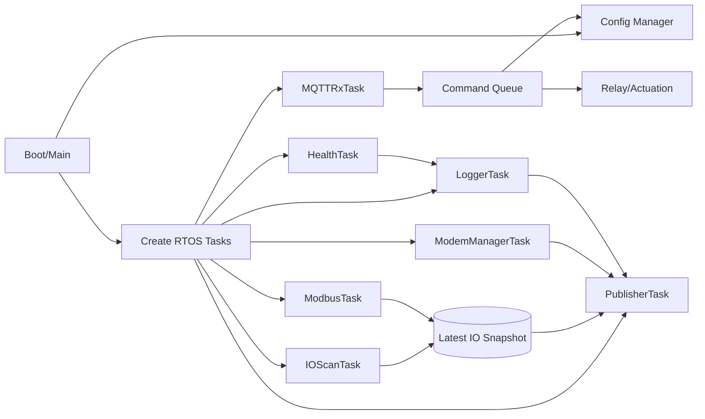

Recommended priorities:

| Task | Priority | Reason |
|---|---:|---|
| UART/Modem RX parser | High | Avoid RX overflow and missed URCs |
| Modem/MQTT state manager | Above normal | Connectivity recovery |
| Publisher | Normal | Telemetry/log/status send |
| Modbus poller | Normal/Below normal | Can tolerate jitter |
| IO scanner | Normal/Below normal | Periodic ADC/DI |
| Logger | Low/Normal | Must not block critical data path |
| Health/watchdog kicker | High but tiny | Detect deadlocks |

---

## 17. Specific code-level recommendations

### 17.1 Fix DI array length bug

Current `g_dis` has 7 entries but `app_di_read_all()` loops 8.

Recommended:

```c
#define APP_DI_COUNT 8
static const PinDef g_dis[APP_DI_COUNT] = {
    // fill exactly 8 valid pins here
};

void app_di_read_all(uint8_t out[APP_DI_COUNT])
{
    for (uint8_t i = 0; i < APP_DI_COUNT; i++) {
        out[i] = di_read(g_dis[i].port, g_dis[i].pin);
    }
}
```

Also initialize every pin in `DI_GPIO_Init_User()`.

### 17.2 Fix relay init

Current relay list includes PD6 but relay init does not configure PD6. Also PC6/PC7 conflict with USART6.

Recommended:

- Remove relay pins that are owned by USART6.
- Initialize all relay pins from the same `g_relays[]` table instead of manually duplicating pin masks.

```c
static void Relay_GPIO_Init_User(void)
{
    GPIO_InitTypeDef gi = {0};
    gi.Mode = GPIO_MODE_OUTPUT_PP;
    gi.Pull = GPIO_NOPULL;
    gi.Speed = GPIO_SPEED_FREQ_LOW;

    for (uint8_t i = 0; i < APP_RELAY_COUNT; i++) {
        HAL_GPIO_WritePin(g_relays[i].port, g_relays[i].pin, GPIO_PIN_RESET);
        gi.Pin = g_relays[i].pin;
        HAL_GPIO_Init(g_relays[i].port, &gi);
    }
}
```

### 17.3 Avoid W25Q CS / ADC conflict

Do not use PB0 as both W25Q CS and AI channel. Pick one:

- Move W25Q CS to a dedicated GPIO not used for ADC.
- Or remove PB0 from analog inputs.

### 17.4 Make payload build return status

Current `jb_append()` returns `-1`, but most callers ignore it. Add build status:

```c
typedef enum {
    PAYLOAD_OK,
    PAYLOAD_TRUNCATED,
    PAYLOAD_NO_CONFIG,
} payload_status_t;

payload_status_t app_build_payload_json(char *out, size_t out_sz, size_t *written);
```

### 17.5 Do not print from ISR

Current callback should become something like:

```c
void HAL_UARTEx_RxEventCallback(UART_HandleTypeDef *huart, uint16_t Size)
{
    if (huart->Instance == USART3) {
        mbm_on_rx_event(&g_mbm, huart, Size);
        return;
    }

    if (huart->Instance == MODEM_UART_INSTANCE) {
        u2rx_on_idle_event(&g_u2rx, Size);
        (void)HAL_UARTEx_ReceiveToIdle_DMA(MODEM_UART_HANDLE, g_u2rx.dma_buf, U2_DMA_RX_SZ);
        if (MODEM_UART_HANDLE->hdmarx) {
            __HAL_DMA_DISABLE_IT(MODEM_UART_HANDLE->hdmarx, DMA_IT_HT);
        }
    }
}
```

Add error recovery in `HAL_UART_ErrorCallback()` instead of forcing UART state inside RX callback.

### 17.6 Add publish ACK wait

For SIMCom MQTT publish, wait for the publish result URC where supported:

```c
AT+CMQTTPUB=0,1,60
OK
+CMQTTPUB: 0,0
```

Only then mark publish as successful.

---

## 18. Testing checklist

### 18.1 Bring-up tests

- Boot without SIM.
- Boot with SIM but no network.
- Boot with poor RSSI.
- Boot with wrong APN.
- Boot with broker unreachable.
- Boot with wrong MQTT password.
- Confirm device does not reset-loop.
- Confirm error reason is visible in logs/health.

### 18.2 Config tests

- Valid config with one slave/read.
- Valid config with max slaves/reads.
- Invalid JSON.
- Missing configId.
- Hash mismatch.
- Oversized config.
- Power loss during config write.
- New config causes Modbus failure; rollback works.

### 18.3 Modbus tests

- Slave timeout.
- CRC mismatch.
- Exception response.
- Multiple slaves with same baud.
- Multiple slaves with different baud/parity.
- Slow 4800 baud slave.
- Registers 16/32/64-bit.
- Adjacent register grouping.

### 18.4 MQTT/network tests

- Publish while downlink arrives.
- Downlink while publish is in progress.
- Broker disconnect URC.
- PDP drop while publishing.
- Offline queue fill and drain.
- Duplicate publish protection using message sequence ID.

### 18.5 Reliability tests

- 24-hour weak network soak.
- 7-day telemetry soak.
- Random modem power loss.
- Random RS485 disconnect.
- Flash wear test for config/log/spool.
- Watchdog/fault handler test.

---

## 19. Most important fixes in priority order

1. **Fix pin conflicts and pin map ownership.** Without this, behavior will remain random and hardware-dependent.
2. **Fix DI out-of-bounds bug.** Current DI array has fewer entries than the read loop expects.
3. **Wire Modbus runtime correctly.** Initialize RS485/Modbus context and pass loaded config to payload/poller.
4. **Re-enable or redesign downlink receive.** Subscription alone is not useful unless the device reads and routes commands.
5. **Remove ISR logging and heavy ISR work.** This can cause missed data and timing instability.
6. **Replace reset-based network recovery with a connection FSM.** This is essential for field reliability.
7. **Use persistent offline queue.** Network will fail in real installations; data should not be lost.
8. **Implement structured logging and fault snapshots.** You need actionable diagnostics after deployment.
9. **Remove hardcoded credentials and hardcoded device ID.** Use provisioning/config.
10. **Use A/B config slots with rollback.** Avoid bricking devices with a bad config.

---

## 20. Bottom line

The firmware has many good early-stage components, but today it behaves more like a bring-up prototype than a production-grade gateway. The biggest architectural change should be moving from a single blocking `defaultTask` that performs network init + telemetry publish to a task/event-based design where modem/MQTT, Modbus, IO sampling, publishing, logging, and config management are independent services connected by queues and event flags.

The most valuable next development milestone is not adding more features; it is stabilizing the foundation:

- one clean pin map,
- one modem UART path,
- one Modbus driver path,
- a real connection state machine,
- a real logging/error model,
- offline queue,
- and a safe config lifecycle.

Once these are fixed, the gateway will become much more reliable, responsive to network changes, easier to debug remotely, and safer for field deployments.
